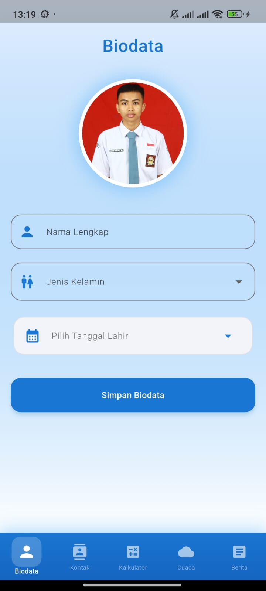
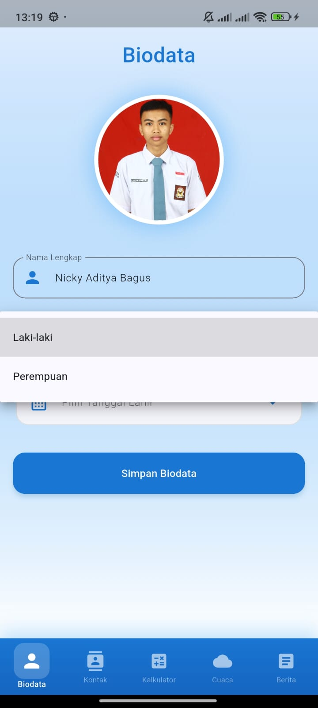
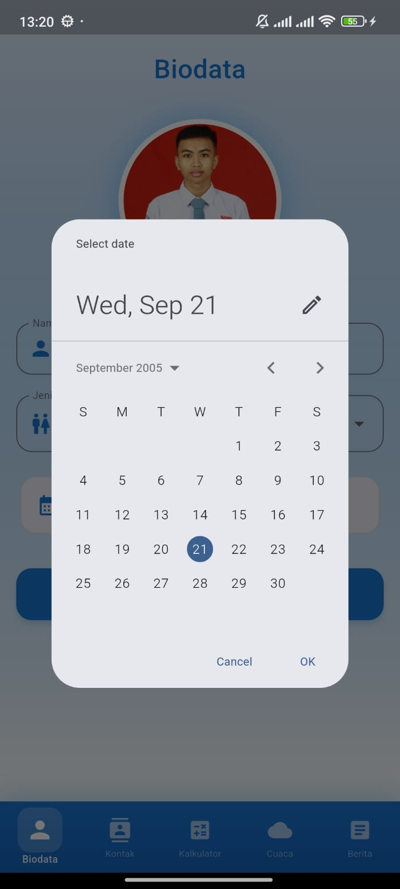
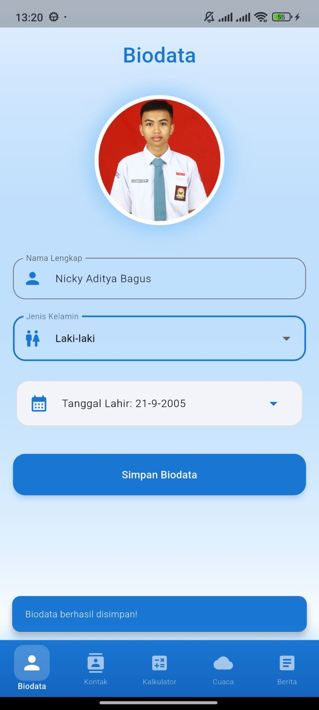
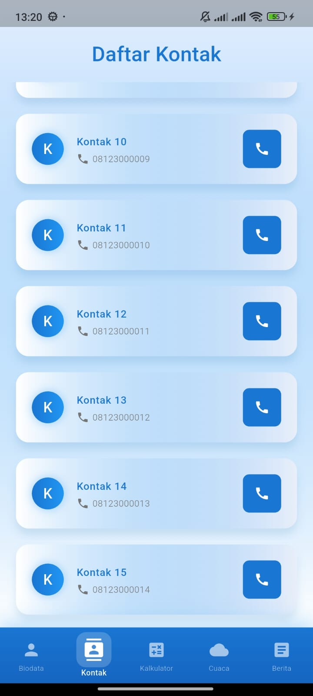
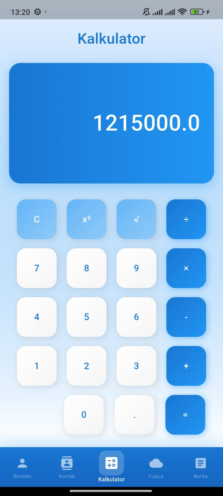
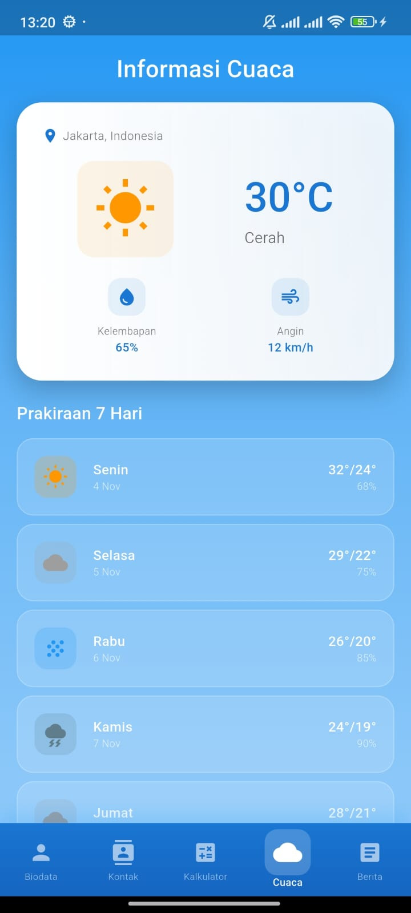

# 📱 BiKoKaCuBe APP

<div align="center">
  
  
  
  
</div>

<div align="center">
  <h3>🌟 Biodata • Kontak • Kalkulator • Cuaca • Berita 🌟</h3>
  <p><em>Aplikasi Mobile All-in-One untuk Keperluan Sehari-hari</em></p>
</div>

---

## 📖 Tentang Project

**BiKoKaCuBe** adalah aplikasi mobile yang dikembangkan menggunakan Flutter sebagai bagian dari UTS Pemrograman Mobile. Aplikasi ini mengintegrasikan 5 fitur utama dalam satu platform yang user-friendly dan modern.

### 🎯 Makna Nama BiKoKaCuBe
- **Bi** - Biodata
- **Ko** - Kontak  
- **Ka** - Kalkulator
- **Cu** - Cuaca
- **Be** - Berita

## ✨ Fitur Utama

| Fitur | Deskripsi | Status |
|-------|-----------|--------|
| 👤 **Biodata** | Menampilkan profil pengguna dengan informasi lengkap | ✅ |
| 📞 **Kontak** | Manajemen kontak dengan antarmuka yang intuitif | ✅ |
| 🔢 **Kalkulator** | Kalkulator dengan fungsi matematika dasar | ✅ |
| 🌤️ **Cuaca** | Informasi cuaca terkini (data statis) | ✅ |
| 📰 **Berita** | Portal berita dengan kategori yang beragam (data statis) | ✅ |

## 🛠️ Teknologi yang Digunakan

- **Framework**: Flutter
- **Language**: Dart
- **Development**: Android Studio / VS Code
- **Target Platform**: Android & iOS

## 📱 Screenshot

```
### Splash Screen


### Biodata Screen


### Input Nama dan Gender


### Input Tanggal Lahir


### Popup Data Tersimpan


### Kontak Screen


### Kalkulator Screen


### Cuaca Screen


### Berita Screen

```

## 🚀 Instalasi & Setup

### Prerequisites
- Flutter SDK (versi terbaru)
- Dart SDK
- Android Studio / VS Code
- Android SDK / Xcode (untuk iOS)

### Langkah Instalasi
1. **Clone repository**
   ```bash
   git clone https://github.com/NickyAditya/UTS_Mobile_BiKoKaCuBe-APP_NickyAditya.git
   cd UTS_Mobile_BiKoKaCuBe-APP_NickyAditya
   ```

2. **Install dependencies**
   ```bash
   flutter pub get
   ```

3. **Run aplikasi**
   ```bash
   flutter run
   ```

## 📁 Struktur Project
```
app_uts/
├── assets/                  # Images, fonts, dan file lainnya
├── android/                 # Konfigurasi Android
├── ios/                     # Konfigurasi iOS
├── lib/                     # Source code utama
│   └── screens/             # Program Masing-Masing Screen
        ├── berita_page.dart
        ├── biodata_page.dart
        ├── cuaca_page.dart
        ├── dashboard_page.dart
        ├── kalkulator_page.dart
        ├── kontak_page.dart
        ├── splash_screen.dart
    ├── widgets/            # Navbar Button Custom
        ├── custom_bottom_navbar.dart
│   └── main.dart           # Entry point aplikasi
├── linux/                   # Konfigurasi Linux
├── macos/                   # Konfigurasi macOS
├── web/                     # Konfigurasi Web
├── windows/                 # Konfigurasi Windows
└── test/                    # Unit dan widget tests
├── .gitignore                # Git ignore file
├── .metadata                 # Flutter metadata
├── README.md                 # Project documentation
├── analysis_options.yaml     # Dart analysis options
├── pubspec.yaml             # Dependencies dan konfigurasi
├── pubspec.lock             # Lock file untuk dependencies
```

## 🎨 Design & UI/UX

- **Design Pattern**: Material Design
- **Color Scheme**: Modern & Eye-catching
- **Navigation**: Bottom Navigation Bar
- **Responsive**: Mendukung berbagai ukuran layar

## 🔮 Future Updates

- [ ] Integrasi API cuaca real-time
- [ ] Integrasi API berita real-time
- [ ] Database lokal untuk kontak
- [ ] Dark mode theme
- [ ] Notifikasi push
- [ ] Export/Import kontak

## 👨‍💻 Developer

**Nicky Aditya**
- GitHub: [@NickyAditya](https://github.com/NickyAditya)
- Project: UTS Pemrograman Mobile
- Email: nicky.aditya@mhs.itenas.ac.id

## 📄 License

Project ini dibuat untuk keperluan akademik (UTS Pemrograman Mobile).

---

<div align="center">
  <p>Made with ❤️ and ☕ by Nicky Aditya</p>
  <p><em>BiKoKaCuBe - Your All-in-One Mobile Companion</em></p>
</div>
